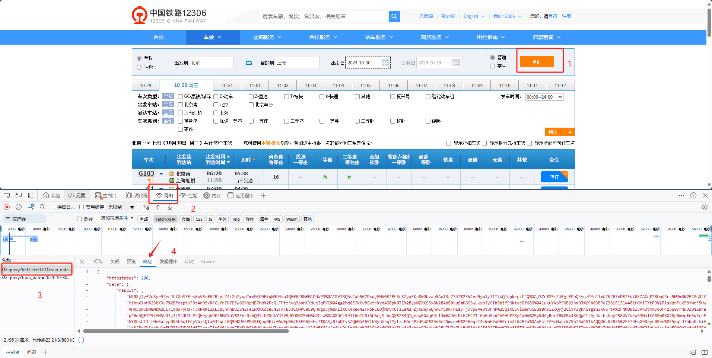

# 火车票余票查询
## 获取接口：



```json
{
    "httpstatus": 200,
    "data": {
        "result": [
            "kRR8jJyfVo8ye5ZecJUtXaS3Ers6wV8sf%2BznLZ4i2u7yuaTmeMKC0FiqM9U4voJQGf%2BMfMlDdaP3%0ATRV13Q6sCxb567PxdjEWVG%2Fh3c3ZyxEKp8HNhvau5Ao13c73AT%2Fk4en5yw1yl1TtWQ1dpkrpiCJQ%0Aj17r%2FsZUfgLFPpQKvqzPYol3mUZ%2B3eD%2Fdt0KZAXq%2BbwURrs5WMmR%2F18q0JKC1R37PHE%2F1H5nD8%2Bp%0AbOKat38NX6gKhrEVvjsLsnhz%2FnduUu%2FwKtOEVylWUh7GH7zezGc5GkLg9BYWbaCu%2FwCRsen%2Fw6lK%0A3JZi86lI%2FWSRyRs2GlQEKj1kx40srum9H5ldOyo9X5c%3D|预订|240000G10336|G103|VNP|AOH|VNP|AOH|06:20|11:58|05:38|Y|yeG6Qo5%2FGcHoMZfZOL6jsf6sXr%2By5CoJqSUGQnCy8OPxlsln|20241030|3|P3|01|09|1|0|||||||||||有|有|16||90M0O0|9MO|1|0||9187300016M093000021O055300021|0|||||1|0#1#0#0#z#0#z#z||7|CHN,CHN|||N#N#||90081M0088O0084|202410161230|",
            "HlhvXlnH%2BtXDu7%2BFmzptUF3t4rD5xRRCLfnEH7D5w62hNpjB7hd%2FcGLTPttjvq9pnHKYduzIqPVO%0Agg2MdGEOKKvB9WtrXvdAQBpK0TZ%2ByyNZXXS5x8%2BAbB0yuSmK6O3wLWxbJyOIhBbjMSjKtceDf689%0AluxuYVpP9NB6ihn0J%2Fh6OEPcZ36iEl31w481HGH1TXtP9%2FlsaqhFuk58YwtF5HwoXgSY15OGLW5S%0A4kUFH98yLlm8jCxx3ZkY0Iw0EpdArSBcibZ2vCyiywDk6wAYzuyPuLvsehc1TIT0FcDgETykbLzM%0AuHtfaBoh3K4XgK11EcPa735k03ek%2FDU8c6eZjd9uWwrw7AHB|预订|24000000G10K|G1|VNP|SHH|VNP|SHH|07:00|11:29|04:29|Y|NH0LKcvrdb5KXzYTx942k9bzSqo5YX6XL1JNNT5ujPOTc%2FJ0oTM9jgzeLV0%3D|20241030|3|P2|01|04|1|0|无||||||||||有|无|10||90D0M0O0|9DMO|0|1||9233100010D146700000M106700000O066700021|0|||||1|0#0#Q03#0#z#0#z#z|O066700011|7|CHN,CHN|||N#N#|||202410161230|",
            "VHR5cNvDM8Mb%2BLT1Vmd7yHo7fJXRXR11XE3BLnHhBUI8%2Fe1WXMXooeE%2FAFBSJCCWPC8B9QHNgovy%0ALiXGK4Reo%2FwbPEBDjNOVHGf1La%2FsyKD6ywQnnCM50RFHLayfjxvpSAe3tBFnP%2BQIXL5viWmr8GSU%0AYlZcQyj2CitYZQKnGag9n3xVuTtV%2FNMUBzlvVKDtmXycOF423S9yrNW3ZU%2BrekT44khF9d7UGERc%0AxKlhVjcSEvJkgIMzaPshmJqMIDGKNpcPb7fmUtNDeZaW64CTEesTnVPX1yjy46l8%2FVnVjMtAFlGe%0AXMwbP2Z1kcga3NR9CShnC4CNnsVRPEAXE8GPJ7ZzU5I%3D|预订|240000G1050R|G105|VNP|AOH|VNP|AOH|07:17|13:03|05:46|Y|IShpFclNbGnlowusSmX2rIn0z9rI%2Ftv%2Brw4O%2BBsm%2F6BU56YM|20241030|3|P4|01|09|1|0|||||||||||有|有|17||90M0O0|9MO|1|0||9187300017M093000021O055300021|0|||||1|0#1#0#0#z#0#z#z||7|CHN,CHN|||N#N#||90081M0088O0084|202410161230|",
            "p2Bo3QfTP5tfMSbD3j3LSJJUJsPzQHeyqbU%2BM2YaY%2FVz0xhQNIzbP8dkYJ7V9dPO8G7BhM5W2CLw%0AXBDCi99J16oTbRiSh6ejSLbqQX%2B4Q1gepwBXwq6Rt1Jm6AJHiPi%2FJ7TiGn0p9vd4V9Hb%2ByCuHn%2By%0AgRur7B%2BxJ8bQpCItApJdchsVny258WVZuKaR3Ho1KA8EwR6X78p0mepfeBd3crESgHVYNyPUm603%0AHDwwmFhgI6MFthkNPZH%2FKSK%2FvPg04Nago2pVNx%2B30sVHsNGQU4L0O3dgP%2BDrTMdjwemhaEInMuVA%0AkIcZ6tzTFib9LDqE2LNalxaOS76Iz4i%2BVmU%2BR%2Bru2P0%3D|预订|240000G1070S|G107|VNP|AOH|VNP|AOH|07:25|13:12|05:47|Y|qGpT%2BlWRs%2BXBPDORqJddJgpYaUSq8f%2BL%2FuIfkmkPK%2FK4%2BXez|20241030|3|P3|01|09|1|0|||||||||||有|有|有||90M0O0|9MO|1|0||9187300021M093000021O055300021|0|||||1|0#0#0#0#z#0#z#z||7|CHN,CHN|||N#N#||90081M0088O0084|202410161230|",
            "hY8hsU13LtHe8uLvp0KAhSoIECyVbikQtw032qnl0Q9GKUAePRU9fQbq0Eic05dfpW%2FXFG58rHzT%0AAyR3pDTvSZQ6HUf69lNWydUbq3MytzcFGr2PKdFwO%2BnBr20mzneF%2F6eqzT4rkwHExD69ciWJi%2BZo%0AaFstZA9cMwLck79aI3aPG1k4QQM6z%2B3S%2FE7RHqG90xyc09en%2F5eqLD3hkuGckifAS5pqC8SKEzsy%0AS7upq4jsQHhiKXQt2nVILKxfoX2Ehjp2ia08J2VkdtqoJ%2BrjmVrUUfrlunAHaN0M2tz4IjKrY7nJ%0AdmwzBt1VvRJSimt8KQ36eMC5Gu0zY3EW|预订|24000000G310|G3|BJP|SHH|BJP|SHH|07:40|12:32|04:52|Y|i0Q7uWIh4%2BGo5hEPg5cWq5LRm%2BSixXw%2FjTrSWhSGhyGvJSs9|20241030|3|P3|01|05|1|0|||||||||||无|无|3||90M0O0|9MO|0|1|O|9234400003M107300000O067100000|0|||||1|0#1#0#0#z#0#z#z||7|CHN,CHN|||N#N#|||202410161000|",
            "1z%2FdKM1cqMylmFUG83iEGV6EdfZlezzT1tGXGLkegCRdSUbRN0WWuHotU7zAqbMUnHHngxwll4qB%0Aa2p8LvDy3mN0cd%2F19a6of%2FksSUkjq7nbtoPGoaLw%2FyZU7qGLcRwP84z%2F692CBmY%2BejI6T0vn6Ghq%0A4ALnDJ85Gfx%2FIwceM%2BkTWkUXfF7d6sxHJq0%2FVLbAsu8dq59NQVlpjnGE0CHXMSFmvDYzoEI6Us45%0AUYuS8CzcSEdRaMs6860ttBs%2FC5rdUD6HlLtMMIFQcZevcJo6ZPpbfMck%2BJujpQIscVlUHL8Y1Nml%0AlDHHWvEqSLHIppar7vxQ1Rx0IfO%2B6aDNzAz%2B3WMZMus%3D|预订|240000G1093O|G109|VNP|AOH|VNP|AOH|07:45|13:48|06:03|Y|heWX1bTgKnJ%2BrTl2ovDuKPJrizpEaYwSvrIZldulOV61rbt%2B|20241030|3|P4|01|11|1|0|||||||||||无|15|11||90M0O0|9MO|0|1||9199800011M096900015O057600000|0|||||1|0#0#0#0#z#0#z#z||7|CHN,CHN|||N#N#||90087M0092O0087|202410161230|",
            "NyA0h97nnZzmlr1naWhifHd%2B93fseZShCuSp0miMgX%2BHq6ITue8Etuou9riE1Q%2BPMIexwUhfUbC3%0ATgljkBzO8Do8YobdidYCWQl8zbUdbZNogWSynj8SpwVA8DSmgrRqcM5CbEmZNCqy8s2gXVzjzRTD%0A4gOO7x0%2BCHXEv3uATqxgeyc8ZzxGuIqJUEkeLzYuiWn%2F1j3b6etzIAZjYynPSuvNgEkg%2FA4%2FTOGb%0AZzus1H6iNP8UiYYz35%2FoIWeZlwTWJl0ltuV%2B10qSSbB6orVHoduZ%2BXSGnJ9%2FUfS2dBKfSQQz8DiZ%0A3I7vksLov4IwYDJleUoFp%2Bzqinlh6zYdO33iRA%3D%3D|预订|24000000G310|G3|BJP|SHH|VNP|SHH|08:00|12:32|04:32|N|jua52d%2B4RxWO9iFjEuhUVrunonB6t8fwpHfy%2FypZRZFKuzx3|20241030|3|P3|02|05|1|0|||||||||||无|无|无||90M0O0|9MO|0|1|9MO|9233100000M106700000O066700000|0|||||1|0#1#0#0#a#0#z#z||7|CHN,CHN|||N#N#|||202410161230|",
            "9PJ3bHj%2F75w1vROjAmvnVI0%2BI3yVcqlhzAljJLXYwB3bNbGNsoLNm%2FX%2F2ZecIMJLP0TfJwrn1Kis%0A5iKndVH%2B%2BmsJUmWlnBtbQ%2BTgIIaFx45GHR2XmsOkZXPof1FZStWAnUi2Zp4rhvSqpBoSwWYwn7HN%0ANiJlR%2BZBp3DsJgQfipMTPenqc7GnYuUsi%2FW3sHSZQGo2TisjC5fNYPrx2WREcwA4a3qbPJS9mghU%0AUwVZF6SGYqLtaHc93TMRwgLS8Viap0qVJaEytQslHnQ08kaJphmLo1vJ7UP27V5ts4OkvhW35siz%0AXZtpo0QF4gKKi3qJ%2FCh4sVF02CyK0A05QONSXvCjUNo%3D|预订|240000G1111I|G111|VNP|AOH|VNP|AOH|08:16|14:11|05:55|Y|5sdLC6stNFARpopBxgChs0kA4oNL9imPU6wl6%2BH6P9%2Fic9dV|20241030|3|P2|01|11|1|0|||||||||||无|无|5||90M0O0|9MO|0|1||9199800005M096900000O057600000|0|||||1|5#1#0#S#z#0#z#z||7|CHN,CHN|||N#N#||90087M0092O0087|202410161230|",
            "N%2BU40pjcGyHWKd6c%2BLxFenPfITvl4xE%2Bq1MPJesyaEVXS8%2Bmuh0yX%2FZiyjszhAcPy2X5CIup39X8%0A7neum0XvpnTYDoUfc6X4PUb6SVG9WJzgE%2BAdBqhZPicdoy6e%2BE%2FuQ2ANRwxRguY2f76Ve2xqPSkY%0AZ2eVFSwBgr%2FNUi4kionV8GnTaHi%2BwtWeurg6jx0%2F5VBGH9KoEHHRDti%2F9R4noi7DCPPxvSU%2FCtxr%0AwZvE8cSc5vO%2Fzc31vVCJd5L1LAnwaOKuxLvHh3lk80WXXV2SmsuzN3KH%2BniZg%2B9QVcaPoOcIwdnA%0AQCHSEgXyAzl%2BwbqFZDuxGPZAuJ370BcspLZ5o7p2gh8%3D|预订|240000G1131E|G113|VNP|AOH|VNP|AOH|08:39|15:01|06:22|Y|82wPmqV5bUW%2FIHv%2BWjMzP4MjBx5J7TJ9BVQjJHI6ztfjGN6n|20241030|3|P3|01|09|1|0|||||||||||有|有|17||90M0O0|9MO|1|0||9211000017M102900021O062200021|0|||||1|0#1#0#0#z#0#z#z||7|CHN,CHN|||N#N#||90085M0091O0088|202410161230|",
            "EloknEd0b1MhXs2MUi5WoIEFmmtPiK2fSkpR2atpXgWLSd%2FwnQxZrU1rPKY%2BptzjBO3hjm%2F5IOji%0AncKzB96s7O2hscm4xEmeB09NiZNNxvL4YnICZ15T6XYMAdZzQqjCy4%2Fd0z5eR3HQ76TuahbEJHr3%0ABp5pmvWPOgC4K4S8kaut0LvtSguTWczfl26%2FfEhvPk63asipPvpZEc75DPIaQszUh9WhTB16dA3e%0ANrhJ6jo7b6pFd3bQ101fNAYS2h27UOHxuBgoTh%2F%2BNFyKdS55ftrfBM9aUzS5DHZr6PpKv8E%2B0AV8%0Am6ZMey8OBcFTQ7ZW5Ef19EW3QuDfwAKVy9%2F2kHzzQIgVvMmKDL%2FMqkb1jdo%3D|预订|24000000G50A|G5|VNP|AOH|VNP|AOH|09:00|13:37|04:37|Y|6leH8KQGZvMeXA9FnLT2oZy8K4W3uTs%2Fc0KW325uzoVMIFdygssogD9ne7E%3D|20241030|3|P2|01|05|1|0|无||||||||||无|无|7||90D0M0O0|9DMO|0|1|O|9231800007D145700000M106000000O066200000|0|||||1|5#1#Q03#0#z#0#z#z||7|CHN,CHN|||N#N#|||202410161230|",
            "TJHqYB6dpcAfLuU%2FW0WkugMNk7ufh8gYuF%2BifF61WUuvfF4SaLGgOvLcA2YxkjmzbHr9kr6kglLc%0ABw3%2BldZl%2F43EhvEWR2fBh4T0V0bkBovAHOqqhZxfGYGimwSFVVzhqTLFjJ%2BSV0GMmCz58MXbFCm%2B%0AMWnZgcTtn2Qm96waB1YRX5n36XWQP7bv5jS4mCFkEpCkcqt%2FehXZDNG2nPozDeRcUitfHH%2Fb2Bg6%0AgAZZLzJq6GJb8CaVdewkIXUiR1%2F1jbl8vWpFq6U1oNzGQHeA8%2B2wseIwvuRK31VTsfsRDAlliHgb%0AM2akvyLx0cy%2BPoXOSC8Hc9w6k7lboE8uf2%2BLlxw9yYg%3D|预订|240000G11525|G115|VNP|HGH|VNP|AOH|09:10|14:48|05:38|Y|6RnPI8If1umjXowrIT7IHqbGd%2F9ln%2BO7WA2wbfh59sOrf3kO|20241030|3|P4|01|08|1|0|||||||||||有|有|16||90M0O0|9MO|1|0||9231800016M103500021O062600021|0|||||1|0#0#0#0#z#0#z#z||7|CHN,CHN|||N#N#||M0098O0095|202410161230|",
            "5osliu0sYX6SfbsdqV9sBBrjhSGOjtt5zC7FdoPTYXUqitBXLMSy4tlyc0mLiLOh9Rr8NX1hJZu6%0AL5UP5M1kjIukwDwaJpxP2Dof4fDK8w1z9NPbvltjl8TkypjWjc%2BgOv4HlJoh65JJozjVzMdE4cJq%0A9bKOIpMMNyq78423lWeAEDNUHcueg77eBnUYW0dNCtdA2if%2BBsgX35MfIowjzWgUEKGu1aVIHvqG%0A9jbY%2BIE%2B2CyXJAKRCZQMucVlPyia%2FwC8TKIn4HAD2lNrxPmkVH6nHZq5xyAkiog5vgsoginLQy5s%0A8Ez32Fd4t%2BuHcGBZl66iZUuh525GaKxcXkBrr%2F8QOmY%3D|预订|240000G1171D|G117|VNP|AOH|VNP|AOH|09:20|14:55|05:35|Y|T4wxaRx7%2FK9l%2BNUDHv%2FIp9KUZ0dszoQnZQHmJ9PhFjlZm2vE|20241030|3|P3|01|08|1|0|||||||||||有|有|9||90M0O0|9MO|1|0||9215800009M100600021O059800021|0|||||1|0#1#0#0#z#0#z#z||7|CHN,CHN|||N#N#||90094M0095O0091|202410161230|",
            "Hx3N6N7hQxIIC7looT0FYJ8vyjdOHB03yaIGzcxgjXjaq5IfNcly98S87wTbCZm9YhI%2Fyb5r9BkE%0AFfRW0XiCIfB%2BUNTXntUCPWMSYvNmECgSJfH1YH%2BUNisEbDPLm9pZ98m95Hr8TOU0RcYBvwqg1Qf1%0AJSQWjSpA5gLF5SxCYCHkq0pcUTJX1O%2BdCzZlUZMODYh9leu6s7ogo03VeE99y6vhdtPiyOyG8b92%0AM%2B5VNiZQdp%2Bs10%2Fx3Ha7FFTojfCnUFBbqrBAHh5pa8iDq5JqjG2bkx1KJ7IXpEnZyAFHgjmaKmsg%0AAWPQ72TtOKRPRgtOpqVMD3VcgkkjQJ6oeVWpu23sXow%3D|预订|240000G1190V|G119|VNP|AOH|VNP|AOH|09:24|15:32|06:08|Y|u%2Fahz7qXkQd%2FpFsG6koGslH41XR2U%2BCvgOHKnT6JMSI%2Btdl5|20241030|3|P4|01|12|1|0|||||||||||有|有|10||90M0O0|9MO|0|0||9199800010M096900021O057600021|0|||||1|0#1#0#0#z#0#z#z||7|CHN,CHN|||N#N#||90087M0092O0087|202410161230|",
            "WiV0EvANhm6Ik4b4aruOLIF1CF%2FNJWbW07sdUcM7uQ7xE3Q%2BFpazsm9p3lIZ%2FHec%2FghIiranXjvF%0AskXs4zdP4dphcQ0TgkV5qVGV5Xzmdu%2BcdvvmB64Okv2Arp6w70RC8tlJhtqizT3xEGci4Wq48Boc%0AVgRzJNEDX8m8rDk5QiqyxE58PZARIfJgIdZ3RlATMxeqLfGNshPefadIdTn%2FN%2B0Xg5iwN8mZ3G5P%0Av5y%2FJTpT1lhrTCBV8Ogfp%2FUvaole1KUvhd4lK%2FJhdcK88%2FwdpsTTmGFKtDnt5b9ZSqvjyJZwoBcW%0AE6h0o8tJloaR8ht75yjNlFP4sEDl%2FXs1YHY5fOkSlXPkWY7%2BBn9NxA%3D%3D|预订|24000000G70B|G7|VNP|AOH|VNP|AOH|10:00|14:35|04:35|Y|nIo%2FPU02oxpGrOmseg4wdIOdyswJ4CgXjayywMSMtdpoac229d1mdBzxuJo%3D|20241030|3|P3|01|05|1|0|2||||||||||无|无|6||90D0M0O0|9DMO|0|1||9231800006D145700002M106000000O066200000|0|||||1|5#1#0#0#z#0#z#z||7|CHN,CHN|||N#N#|||202410161230|",
            "YVAYfYPJP%2FZPyVDkNB0GxZwpUD4QDEc%2Bj%2FnxmD5exdH5cbIKInsVIRgDOnTxVyOIsjses4GNNTze%0A9YHAqejSfZf1WeGGm2Pb0rI8J8TZfJqf2tPzYKjQ5hGo0uYzyltvoBOBXVzWIxdkm4JjAuaRgzNN%0AJP1kXt7uMtXV3Z%2Bp7E3F%2BaqH2R8%2BLO4hZZfz%2FWBh56q03Vq8GsDeUMf1VWPsMD%2BnJh6kxZA2rcmT%0A%2BDJF%2F29GEvvJfJr4ETyKUx3ux%2FDH%2F0ds%2FL7GVaYYLfn0h4iPLnPOxvRBFjjtMMopiLAfKNRVUiwc%0Aa7jXLcUX6i0Fw1DCVkKv%2FBibe9H4ZYxzg0R9VT%2FB1Ps%3D|预订|240000G12116|G121|VNP|AOH|VNP|AOH|10:05|15:42|05:37|Y|3QuDbeJfMwaMO4Vvn5%2FSTAdMP3bcRmNo%2Ba0JjBgL4mxBrzC6|20241030|3|P2|01|09|1|0|||||||||||无|无|6||90M0O0|9MO|1|1||9231800006M103500000O062600000|0|||||1|5#1#0#S#z#0#z#z||7|CHN,CHN|||N#N#||M0098O0095|202410161230|",
            "zwB%2F9siHVDYvOULmc4uP7Bo4ykS8nhQ9UTj2Q55h9GSfSU7mSp%2BX1bjS632YGjV5%2Bf%2Fz%2FUHqFWc5%0Ardb00qcyKDv8bKc%2BPDXEfI6fRNslUwXseqDh4bBg2D%2FrEVyYhdea6qOSNks60rFQQs8KICNOi6fm%0AKmeRApIQyTcrlIgnc%2BoR5TI2tOLQOZgnhtUGLQovPwIgUmjv5bHJHYk7Iloym1zpyPq43Fz4QL4o%0AHhb27xtGBJDeoAUsdUkPFcpQ2N9ASdcK1TQCqNNkzXGmH7VNG9yGR3abDJfyUYQJ6MXQQfy4mzPz%0AHNgCCcvOOaJQgtYqSTYgrNRIZsvr96QjbgYeP4K4%2FrM%3D|预订|240000G12334|G123|VNP|AOH|VNP|AOH|10:14|16:26|06:12|Y|HakWS08EAYKWIWjrjC7M%2FcRlKgfiYq0fX0l8ggP17cctlvvm|20241030|3|P3|01|11|1|0|||||||||||有|12|5||90M0O0|9MO|0|0||9215800005M100600012O059800021|0|||||1|0#1#0#0#z#0#z#z||7|CHN,CHN|||N#N#||90094M0095O0091|202410161230|",
            "%2B5GmkKDslauv8aZVo6HAgk8JfsAI2VaT6Wp6ApHTVWSzTBC6%2FcyBaM%2F1MbbL4rrK6ZveJG2O4sum%0AuA2afCdnM8Fhw3L83wqNvnF55wv9aNXNfTwDferjnO%2BhGjHWWezZtdgutgeqpsfEsgTy8Hbxv6ZF%0AHeRTsYJNtC4anqPvl6FP9E%2BSs8FbDOEkqWiHd%2BHk9cMWA7ewrxvhO0oizLgmimZ%2B0hp%2BWPK5FSBP%0A5ksfijKtV0PwANEwQkIic21dTZz5hzjBUWGoIeqYgPyCKOyP8pZGSVYMUDIcYgrfuE1xGScXHO%2BO%0A7J0zccgAUTdu6fYGAmuGerXsAjHvgNyQRUPPU4e%2Bepw%3D|预订|240000G1251T|G125|VNP|AOH|VNP|AOH|10:48|16:50|06:02|Y|B7Ogbp%2B6XvUdWdVCA02pfMZaT1FR%2B2QhTzbAn%2BY5Uxg1R%2FTS|20241030|3|P4|01|11|1|0|||||||||||有|有|15||90M0O0|9MO|1|0||9231800015M103500021O062600021|0|||||1|0#0#0#0#z#0#z#z||7|CHN,CHN|||N#N#||M0098O0095|202410161230|",
            "nC80KGZB5kDRpFSNVu%2Fl1ryi4bxuyL%2FllaYzJk%2BUH%2FHWMXlf9SrIMUboaej4XJV7MS9my1EAYghT%0AS7hO7BF6HzRVwMLrFobGGjf%2B5P3o%2BxYCV7Y4cx1QT7Sx8jHwpjpCICY1yTrn3MkdZVVgfr0TRpO6%0ATE%2FbJnrIbx6WTVB88gvf78A2jHfnlaenPyWLBVHXncAfYMM0NRBJzd1d822nlbyofaQ%2F653RLY4V%0Ae4GWt4YOTzjNv4%2BHUPs9%2FGhg3Lwo0roC3ZxJ6JxSpZW%2FO2kz7So4fO7HHdqPe2aXKrd42WLAvGlE%0ACNcRKzhdSI08MueXSZm8sZJT1VL6ldDuqxIUu9pFsXeyOnjzSCHhXgf36Bs%3D|预订|24000000G906|G9|VNP|AOH|VNP|AOH|11:00|15:37|04:37|Y|h8M6d%2F5FP%2BBu6VCqXjTUMOOlY%2FRZtmGb3exwlUd65fVRwPmU14grdvdHf2U%3D|20241030|3|P4|01|05|1|0|1||||||||||1|2|4||90D0M0O0|9DMO|0|0|O|9231800004D145700001M106000002O066200001|0|||||1|5#1#0#0#z#0#z#z||7|CHN,CHN|||N#N#|||202410161230|",
            "XFpX0jq388X1HrOg1ZJpw7DSoudA6qB8P7NCVRM2mBFe9AcKzQpciG2n0Zvx9yNfLdcn09qlGbxz%0AV4MSMjI3JJlyRkkKc1%2BxyCKlMRp04KfpXNNdSGAByxEEHpDcGUXotdkktnb3XtSVjG17gB4i%2Fxt7%0AzpSKfALiYkS3Q8SiXT%2F2lQ4H%2FoTi%2FP1CFMo1e%2BUP6rjpbd56fBp6VmgxGHjvUQzG8MvRFWQfTMSg%0AR1PJgJ0bamaVHE34tYh94iQWodhLSOmPSHjczEZTLNo%2BT%2FDd9ZM7h%2FKKIvdJq7NVE%2FhPmkwejm%2FV%0AxPfgOjqxN5dT8LHBFIGY1EOldSJlAixx55CmZXytxrU%3D|预订|240000G12741|G127|VNP|AOH|VNP|AOH|11:05|17:08|06:03|Y|dROvsdEhuVpx57%2BpwybHYA4hCTLiRWouQzKL6zOTgiZGox2Q|20241030|3|P3|01|12|1|0|||||||||||有|有|8||90M0O0|9MO|0|0||9215800008M100600021O059800021|0|||||1|5#1#0#S#z#0#z#z||7|CHN,CHN|||N#N#||90094M0095O0091|202410161230|",
            "Z5bmmj5W0vccP3jPNiH2ik8LI%2FIsADMGbGQh4DT6v2VunnQ6s9gFGJ62W5PC6Jr5QnxC8JZsPcII%0AOKC%2BKI3aaXcQ1d%2F6Fntx4S2xdszjPJhN0a4%2FcIS65UdVt4hw2Ov8RbXBXUF1C%2BczviN7iMytJWtY%0A5jjfty5MGaPNNq%2BpOCgWLS0QtcXsH10wtvbY5xmFMIBiZ81vLwGBxCCS6BPQNXbQH5IrhLdt12L4%0AXqfVAUEUbjn1zATetfFhBJWffRfElFat4iZZt9pEvsXrumHTzdiacL3RQ8IKQkktXOIFxCOW5ipr%0AM1evhT2mjXP6YGhRLoThsaZqdNEsi6zce2EIcuq7wA8%3D|预订|240000G12922|G129|VNP|AOH|VNP|AOH|11:18|17:38|06:20|Y|AhewXg70y5ZIRBZzS2lbnF98FbDD%2F98ZdS3pmmLzj3ESTEyY|20241030|3|P4|01|14|1|0|||||||||||有|有|12||90M0O0|9MO|1|0||9199800012M100600021O059800021|0|||||1|0#0#0#0#z#0#z#z||7|CHN,CHN|||N#N#||90087M0095O0091|202410161230|",
            "K694XZqgldBGUOdAISaufH08eb%2B5WpzG2MVDgStFba0VAm%2Bng9LPCpC4lsDpaHiSqZmkfsqw8XS7%0Ar3m%2B9qzNSQkKaCMk6FaaJzHYaz91coOg%2Ftvh0rfPYyzqcffWjujxHKETtIwKND7fxW76Jyc5MS8X%0AUjiB9QZi%2F5rs27BwCbOqJ3Rm1dlvo2Bcj93b5hSroh40C54Uwjr51uDD005iEV9LygoIpdWjT1Es%0ApNwENhj6yHg50nEJ814Rg2jzk0gqBTt3xjI%2Fq9sCuZfWwpwoV2oukBygu31JQnlJyAhf1QjGl8lp%0ABEhA8EaN9671vrEViJIF69RTqBTMod8pk%2F52oz73q4A%3D|预订|240000G13116|G131|VNP|AOH|VNP|AOH|11:27|17:22|05:55|Y|NntHSj6q%2BEgQg0w5d4fUG2MTJeyJJrxZ7yKGziyfiSCXNMYg|20241030|3|P2|01|11|1|0|||||||||||无|1|无||90M0O0|9MO|0|1||9215800000M100600001O059800000|0|||||1|5#1#0#S#z#0#z#z||7|CHN,CHN|||N#N#||90094M0095O0091|202410161230|",
            "7niYCKl1J76%2Bvz8cb4HTicJnD7FxHlqsuF8vbx6mmRtZuECxWAHuoI%2Fgl8puzaLD3dq20SsvC%2BrI%0AdKiHKWjC2qKvSc40tI5FA%2FSWfp%2BZ2TSRUZNkDvQW92p5dGMtrSJnveXMIAm7ZDiwAeTS%2BlBXBHi7%0A9vLJVQiiB62rJSF9%2F3YgdjozVaUIVVt%2FemaeGZPe1tju29a8GvyMQC348vHKbpRCoYJmhjoSj3Gb%0ALSATWCTypjS%2Bi9a96IH9%2FAlq91ezyQ3j8EyrVc9FjwSzS6%2FeaPq319a537jriy2wKhDyupLUBAV9%0AdVzGZKnnEJtevUUMGT3AZc%2FGNyCQDELLIgpvNw%3D%3D|预订|240000G1330O|G133|VNP|SHH|VNP|SHH|11:50|18:02|06:12|Y|FGIyQIyIpXii9InjLoq%2FhPgx%2BQTPrALE3g3OHOV9eVargPt9|20241030|3|P3|01|12|1|0|||||||||||有|9|3||90M0O0|9MO|1|0||9201300003M101300009O060400021|0|||||1|0#0#0#0#z#0#z#z||7|CHN,CHN|||N#N#||90086M0095O0091|202410161230|",
            "OmeUOlmhPhCtKJgVwy54hfsrGzATcu3MSXFpOcBroQJT13R7iXI7l06KyHA%2BB5e4JvfBfaTv496o%0APVoHl3EP%2F9EagYyE8%2BHBEJu%2Fjq7Nr5Ix0g3BRdDt8h%2B0s%2Fc6eMr35TtYi7FIA%2BOJbVXiG9Ym6AV6%0AkNkK2zR7UQH%2BvZM7l0XzlnlRFfGJp7XLjDiwSIMwI9aMboJ8yMdDz121mYdY%2ByLpwI1%2Bx4%2FVk5ht%0Aao6AwJKBNS9dL9%2Bgs5JDhdsLslGu1kZDePgVCiKW6Fkse43CFbs1BwTNH5qxb4QNcp4Va9hP3n8c%0Api3pcSwPiNLy8A9yqbvDSCQtTTFg%2FZh5o8IvNlPO91SNovhvC0QWMw%3D%3D|预订|240000146130|1461|FTP|SHH|FTP|SHH|12:00|06:45|18:45|Y|kIlvcAe%2Bp3ZMXPCK75CS2J7C9GNzxy2s0l5Yuk8Y6aXn3GzwgEJh%2FIEc3ro%3D|20241030|3|P2|01|20|1|0||||3|||有||无|有|||||103040W0|1341|0|1||1015250021302755000040443500031015253434|0|||||1|0#0#0#0#z#0#34#z||7|CHN,CHN|||N#N#|33027553102965320285543044354104635||202410160800|",
            "CFHEJbtZbvwGUAol1wYkqZqGHz7MQUcoKEs0Z5GyaUKUoGYhanmGBwMesL5TYd29O0uTyM2CkO9a%0AAqVaMNIledriZLS77Htc7s4spkET%2B%2FjcaeHGPrWAjYQmewCRKjbSBJmdaaqiSVY91TV064K9Sbiq%0AKUzgNWe3BVcW0yJ3MNrzy%2B6Tq2xdUJVgSXTrrQp3zGjbKxWIPmGPestMOGEXa3BdIVq%2Fcam7F4oU%0APneYPHkOaRaTyjHxKk0hzKQ62kOar264wBLuW9EZ5YmQSL7xbVSxJO07U4UbHQXTcP6R0g%2BxwPsi%0AIo9gi2U2Axdyxppro6U9T9tPv0T0RFdoOa9IU6FteLhJziDF7BS%2FuaWabto%3D|预订|2400000G110P|G11|VNP|AOH|VNP|AOH|12:00|16:38|04:38|Y|bMvwUfT2MjPwgKjSvsIAxmdnZFHNLeTStf44%2BYZ7YmFKxBPK0K48z6kC8w0%3D|20241030|3|P2|01|05|1|0|1||||||||||有|无|9||90D0M0O0|9DMO|0|1||9231800009D145700001M106000000O066200021|0|||||1|5#1#Q03#0#z#0#z#z||7|CHN,CHN|||N#N#|||202410161230|",
            "%2FCLjhXwZG2XKrh5kwNDs3KEOPLjrjvhrkAY2w8%2FvnO%2B9PmH9Lsn%2Fxw9kk8h%2Bxng2EZ3U470N2XVr%0ABY6l1cyDG0pija3SKoI%2B2lkUrtHj2v%2BOTqGvZRvB79B9iEc34mgHlqH6JNfV4UvFXiE8GDPD9dOC%0ASimro6d%2BCxGW0tXyZk8l%2F%2Fmf5Vi8rpUmpwuujESx6ydvzTHvoNtLEtRGk99xIuVoU%2FY1032eci8u%0Avhay2oJLVuaTNEOVHAFliHds9%2BuwFL%2BIC2hsUSW1Rk72p%2Bk8MwgmJOHqum9cIWqYM7Zg4pqxXK%2Fy%0A1crjvlHedFwVLQsM8SZIq4kqq4I3d6YY6kU3JFfqZOw%3D|预订|240000G1350J|G135|VNP|AOH|VNP|AOH|12:12|18:21|06:09|Y|2EXm0hFiY31spmZ4LdYh8IB51D0hNeKfIPfSCkJp4%2BrwigYc|20241030|3|P4|01|13|1|0|||||||||||有|有|13||90M0O0|9MO|0|0||9199800013M100600021O059800021|0|||||1|0#0#0#0#z#0#z#z||7|CHN,CHN|||N#N#||90087M0095O0091|202410161230|",
            "C04UUEMUfjqRH1%2BC2vJAn1%2Fs2JZPuFQJ5yYzhDrQa12e367G6%2FcqMKzZ8kXuQN9mY6g4GtoRe2h4%0A5iKdD5By4UL%2B%2Bguag5Ido70FgCPqXY%2F%2FdjBXXWWIysSvp0%2Fpu%2BxsP%2FHQWSPM2g1dlnR%2FmLzmZke%2B%0A%2BazrJsacw9rJ%2BuYCLQCoE4n0ukObdPODo1%2BKznAuLpPLS7LmAi7IfloWz67fVM7fUA%2BfAPbz9Hqz%0AFsB8GlsQXfzOoDPjj562XDNxm5t2AxjJ64vxNhRRgM0DRe3%2FZW6r1hequuiu4w8I5AjTrew2lk8r%0APv25wBc712ASqoN8OzwDg%2FtmFIVNGUCJdO37CqR4E2U%3D|预订|240000G13716|G137|VNP|AOH|VNP|AOH|12:47|18:56|06:09|Y|mCGcnCcHJU%2FpqcItyVuQJkUOjSfxeXbmtjgAjgt45wyimXp%2F|20241030|3|P3|01|11|1|0|||||||||||有|有|11||90M0O0|9MO|0|0||9199800011M100600021O059800021|0|||||1|0#0#0#0#z#0#z#z||7|CHN,CHN|||N#N#||90087M0095O0091|202410161230|",
            "1jt1IiQvPh6pkIAeCX2t5ierU5WUCFvobA6XgKGz2TFI5RcREY3%2BS7HeVf96z9w6kK0SGZvresqR%0AVKAEAB9zzsnZUhstdkRFTJ11Is6E6q0Io3Iqh%2FVvzCBYnWu0gocJwej%2BF201RWpzEIu6MQxEywIh%0AlhkilYlNm3rq%2Bd%2FK2dOAoriHT7lgQK70j5wYlnpKQ2OhJom6J7F3ZnuS2wTqwjPgfK0ZJ4K3Pe1H%0A9Aof5fpDAgf5Y7LnYJXBYr%2BodJZuUMOOvSuQntl5UQQuRU0heonQ1gMqE9KZWE3AvrmABvsNcK32%0A4tGiZANa7TMJBiUOsPkKMhElQmir2BNLSqANbDoCDggryu6Psj4qag%3D%3D|预订|2400000G130D|G13|VNP|SHH|VNP|SHH|13:00|17:35|04:35|N|ueLC0vPLVBH%2F6NNN8TRkiPy0rZsk4qW5XRyr6hsk98MWPDIMWnFoZnG1JWA%3D|20241030|3|P3|01|05|1|0|无||||||||||无|无|无||90D0M0O0|9DMO|0|1|O|9233100000D146700000M106700000O066700000|0|||||1|5#1#Q03#0#z#0#z#z||7|CHN,CHN|||N#N#|||202410161230|",
            "U%2BxwXQVolLwUDy8cfFk%2FtaF6fQ%2BiKo5MsMxd5ZUo5yHEEos1nRyBgDlq5HjA3gAG%2BWPBosyD6%2Bb0%0AjkJfXxgRMgHQqU6o%2BIH908Z8uf4zlGGtxfyGqHGcfPRDMpwq9u8ED%2Bo3NX70vZvkBOvC5ol0SX3g%0AXA531svuKCfzwWPdjeU3TeVrJUmwM%2FIqkmoBpGUC8RdOA438HKM18H3qlWRn2xd8mMsd6B0mG4rE%0ANVP7kvdlJlDbSn%2B8NPgGlS9T39tb%2BC18Ip94zJayrvkw52ziJbrr6yWOYoJr2AfW6nXoOUPEBT1%2B%0Ai90GAqn5aMm0vDKvCj80%2BEV68SM3jJFs9Stg1K6RlsA%3D|预订|240000G13919|G139|VNP|AOH|VNP|AOH|13:04|19:06|06:02|Y|dcea27otRXzV%2FLB3AjbVWUL7dRnA%2BcKtzkHDSx00Pm5g4F5h|20241030|3|P4|01|11|1|0|||||||||||有|有|14||90M0O0|9MO|0|0||9199800014M100600021O059800021|0|||||1|0#0#0#0#z#0#z#z||7|CHN,CHN|||N#N#||90087M0095O0091|202410161230|",
            "t5RE4o%2FKE3j9G8O0Jh30bGolHDBnnffANonK0Sd5Vm9viZLopUixVR9p20OMx13Sw0ZEKum2kWl4%0AJFRJIEggotLkyjFjUCqF1PWQoOuE7t4E%2B6ONVsnG1At1KlEzlUwkAyduk4q5u1zUhOKjPxcGH1mg%0AmrNgSgCTtLGl2gscIUfTmz5FKV%2BgnLxWI2Lh74M5qR6Zrv1He5Nd21WWcWmci5eJgkCAHe3fARty%0A4Mww1QwijeAycYAF7c45C3il9Lg5a66eHpOHBca0xJuu5IwqYLwt6PDJIwT6ljV0cAGguj8ndFSg%0AtETrJfydOchgfJJ2vQyhnXuMATAEX4H1DRzX4mh5J%2F0%3D|预订|240000G1410R|G141|VNP|AOH|VNP|AOH|13:34|20:08|06:34|Y|1qtLeWjo%2F3RnlOs7Xmqga9AqwQy1tIAddPrqUd%2BtTnr3pAvN|20241030|3|P2|01|13|1|0|||||||||||有|有|13||90M0O0|9MO|1|0||9211000013M101600021O061200021|0|||||1|5#1#0#S#z#0#z#z||7|CHN,CHN|||N#N#||90085M0089O0086|202410161230|",
            "uFHHPlL0MidxYiyYEt43yyaUjOtBgQxPmbZ%2BX6c4rtc8Fag4kZfa5aozw0MFUs7iDHaLmQ4kg2Wv%0AC0PSiqCA9mHBzZLDVQ3R7lRr3gi8V1W32BXFg4ql1%2F4DSDUJJExRmmmuJvO5CNAnuN7gsvnTSw8q%0Aq63%2FBFlh8lnAGvelfBS41FiP09s80xYMjoUWz64200dHrnVgK10rRTdo32%2FLh1jwkvkP4GyIAPod%0Al6mizsJogg41pVTu0UviunI0pc4jNccNHvPv6xjMEqVz1PJEVUWoDor8jl5Ij9GFROXMbwHzF1mQ%0A80D%2FVufnfK6C6VCl2FC6O%2FRSgpYrSzbbVlnBp9CGksyFiVNUDKMdmmrVJ70%3D|预订|2400000G150J|G15|VNP|AOH|VNP|AOH|14:00|18:33|04:33|Y|o5PtPAz99gD6Fc%2BGdHPyuCBSdWwCBogXMbdWlJCSJyyPQtQE1J%2FR86nDr9I%3D|20241030|3|P4|01|05|1|0|无||||||||||无|无|1||90D0M0O0|9DMO|0|1||9231800001D145700000M106000000O066200000|0|||||1|5#1#Q03#0#z#0#z#z||7|CHN,CHN|||N#N#|||202410161230|",
            "Aa8Ucj6BuI88dUl7%2BP9cVJIq63PB9P8HwvPr8D3wZ7G%2F3WnGbEOopRepfHrc63RPcIXmLrEHjS36%0AIg8FT45wNqYbo%2Bg%2BTQl2G94RKsd7aBM%2FfstRMVbYapL8d8ImsxTwKRq%2Bw%2FdlSZwjo96otKOTPhYM%0AEzh8tkUC0E%2BSJV%2BirXBNBVHcHbON2hQAxMAVw8PskYO%2FKyz38UDG308m9%2FYIvqZNSwNfXp3chS6N%0A44gZBwB6hvbBtjQtquANZ490HFFjG%2Bi43MfbnBzaENS6jNekc5KwyFh94rscnXP9NBUdFD9mp76M%0AKnV27DAdSaH2fD%2FlGUN9vkIQIqlf5Wja%2F3oJYlEP7gY%3D|预订|240000G14311|G143|VNP|AOH|VNP|AOH|14:08|20:07|05:59|Y|6iJoZTNCYfOIxk1JYJNjyJwUwOUYXui1Elg%2FCatb2ZNcpI1Z|20241030|3|P3|01|11|1|0|||||||||||有|有|14||90M0O0|9MO|1|0||9199800014M100600021O059800021|0|||||1|0#1#0#0#z#0#z#z||7|CHN,CHN|||N#N#||90087M0095O0091|202410161230|",
            "8yTbOi1ZCgaGzclK6CMZnGLKIWJo0b9h9OH%2FaSwuRpTCLZSm4IBPQ0qxeILQH6SUbYl0WfkQgKd1%0AuMulgVzvD1LMG9SJBsx%2Be3FOe6YOu3vPix0CB%2FWH%2F5kdydDbVvW%2BVx72rJdoe0gtNYJpEIT4T27%2F%0At7Cd5ggG2SHWK%2Bh6KN4Dsrq4kubr%2B%2FU1hcNF2ArgTsJ1vsszNRG34sPuVEVG8VGrGYGIfPVj%2FO4P%0AZ3KUufMXerzcO6Dy2JBJkIqFAGSRsT%2FlYsaNipR%2F9rw%2F42ztJvqisqrW8Jp%2BUW4rDMaZH4wYXp6B%0AmNhz%2BX4nFCZWPJXsqEHmZ7rHANUFMQDXMGq%2B6ou0lX8%3D|预订|240000G1450Z|G145|VNP|AOH|VNP|AOH|14:14|20:12|05:58|Y|CZ57lcPtWQm%2BXynxLMtBqd%2F4%2FbH7EZScP60NwAREVcF12x8L|20241030|3|P4|01|11|1|0|||||||||||有|有|2||90M0O0|9MO|1|0||9187300002M096900021O057600021|0|||||1|5#1#0#0#z#0#z#z||7|CHN,CHN|||N#N#||90081M0092O0087|202410161230|",
            "nUw3Kixk2AF0g3aYC1GOtPBr94faGmMbRMEz1fsovdl81XjUZAYKnzJN6%2FzVnKVP89%2BJmiDUHboM%0A8RND6DXRdjtdIRo%2BqA%2FyFl90i9b751XKANTDiAHBD1kdIIOr6tN4Xl18kxFgz%2Fy%2BGDs3Q360wYTG%0AqbUEyRbbmsSQUz5Y8bYPCUdMT%2Bbcr89mKB7ozTbPGSF2ovqJk%2FCGhFvA%2BLbnqI0KkPudvGRIw5zS%0AhiqWIXM92xHTsz3WNXuKogei19ijGQZmBFY9f7NxZkXJzHDZzT%2BwcxfnWPSpQvHBBmFPztorjlMg%0Am6ZSuqwieQge5zk3QRRZKOXGIoPC06fBxjhF179NFVY%3D|预订|240000G1470M|G147|VNP|AOH|VNP|AOH|14:27|20:43|06:16|Y|Sayr6F1z33rLw0tVKi%2B6Zabo569G7Lk2EQ%2FLbApGApdh4aBG|20241030|3|P3|01|11|1|0|||||||||||有|有|16||90M0O0|9MO|1|0||9187300016M096900021O057600021|0|||||1|0#0#0#0#z#0#z#z||7|CHN,CHN|||N#N#||90081M0092O0087|202410161230|",
            "Wl2u0W7hfEeyrpbAqINudOtMi9aLbwRtb3Mr%2BaJh9ruxjmA2dSNjywIddqqEZECIAbtcTNYgOLF7%0AvdllwZkwb7EwMT9qoXHe0MHFsW%2Bi1eIzRvaxHgbLafX8yuP52g4OSybRR92WXO0fpRfugiDle0pb%0A9nD98JqXGzKYYqQbe6Nyrei81dsJBUbywfBN4O%2FFqMf3oYqbWqlcC568QxS3IXlZmDOFrmebiGVC%0AgIxuU%2FJKeusqMUTDGNmZu6frsEjNZvrGxDRpXp7diHjH7u6r5VZLV5vRoEGTGtRm4dYhHcF6LLps%0A%2FGT5UEL8VSw4zzb71vw1QXpaBDyO9MxEeWLfZgyAJfI%3D|预订|2400000G170F|G17|VNP|AOH|VNP|AOH|15:00|19:34|04:34|Y|1OHzEeCsx65HzzSuRCIJ9UzsWNSEnUeqWQuITxgWG3F8HQ2X|20241030|3|P3|01|05|1|0|||||||||||无|无|4||90M0O0|9MO|0|1|O|9231800004M106000000O066200000|0|||||1|0#1#0#0#z#0#z#z||7|CHN,CHN|||N#N#|||202410161230|",
            "%2BOk8QDPUKul8SBIz27V4MB3Yf320Nca0k7uH30Mi9DmCEFQMp3XiR415ms8%2BgRO0Om1hjKORSDHo%0A4dQ2Yd%2BEpBd2DL6x4AacSgZbox4X8Y6jxMmHHfMrlFkoDKp%2BXYbN1xTHKh%2FnYnQl7HWW8GaTrhqb%0AWDP%2FPoks%2Bt8ZMkYEIJ6lrB05uZjxTHrF2ktRIcIN8irefAfkTE3%2B5yXdJEk%2FPatofwz1MwILPDui%0AZEbcwLTDMZJRTi7pQpS44y0WwQ8jRwri6aLUtMZewpwUMKhlb5HK%2FAWhyCoYohoGn0rSMqJDpr2u%0AYZBJvfb7x71Z3nLcvVMB1CheV4B8vebCaV75igkNWyE%3D|预订|240000G1491U|G149|VNP|AOH|VNP|AOH|15:08|21:10|06:02|Y|Yf%2FUso%2Ff%2BfLVFJo4c6dYFc9VuWkh6SFQcwI8t76EVmGRvqzn|20241030|3|P4|01|12|1|0|||||||||||有|15|无||90M0O0|9MO|0|1||9199800000M100600015O059800021|0|||||1|5#1#0#0#z#0#z#z||7|CHN,CHN|||N#N#||90087M0095O0091|202410161230|",
            "xZgnYxUA7CiwAaPz8ifFPq%2FkcEOlcIW2zdD01HDK6FsqHN6NQINl8bwj7AhK2E3tlBj22IUa%2B0UA%0ASyxzvvo8jgd9XEd1SypIXGjZWvz3lxz6j5l1iT8nKltUxyIIhZ3mV0HKejTeSFZj8xvmHZX10xLR%0AYXZBBKDCGHwRUQoJxJRZsF50tvJjTLD232zF174WLjIXBSHiSQ1DaWPG2Y3Js5qv%2FJVaeYpMqsja%0A45HHq%2B%2Bg%2FKaTY44rlpC3LByHgEeeull8La3ENdqjHf%2FDz3nfGZPM1G1czkT3MidmpAK%2Fwt1C3LIN%0ATqXOhhOkljJQGaFiQXp3oeOShWfwJeOKtxdUYT3CI64%3D|预订|240000G15136|G151|VNP|EPH|VNP|AOH|15:49|22:12|06:23|Y|3DE2Avsw%2FXvGhNXTCTxYL8yJJZ1KXBD5xu5d3hPh6GxB4gsd|20241030|3|P2|01|13|1|0|||||||||||有|有|10||90M0O0|9MO|1|0||9174800010M093000021O055300021|0|||||1|0#1#0#0#z#0#z#z||7|CHN,CHN|||N#N#||90076M0088O0084|202410161230|",
            "Ks0QVlSHOxpo%2BeoBB9Z0EMfWqfdFWkVJSjupPiudesPDYsY%2B2FfZyXtCFL86o0ur1sAFNS7i9W%2Bk%0AdH%2BrdUeB1B0P2e0n0jz0OBfvGOugHgVtTS%2BGTh%2FWTpjhPaaubhkvHXS%2B250kd5%2BCEfzxgPDz0pdO%0AgKd9FmzY3LOiyaNUOttGRFLgogCovBqF1BYOkMswg8uJYDtFvAsRCxJE6KAMUcfGiEwcGgPss3Xa%0A2ttPXVsPTmXZTEHLQ7x%2BaUAN3ZqGLhhq98FEIvrhAQAAQ4qDapzQsiMMXmGKoU%2BWF2%2BjcqXhUuJ%2B%0AhnYkZjrtIky80eFah0xbHlaXCsiS36qOakeSQr2WLA8%3D|预订|2400000G190Q|G19|VNP|AOH|VNP|AOH|16:00|20:28|04:28|Y|H%2F%2Fy1SebrdW0jKBCHY9qrpeLFQc2ClBXbHyEex9mNKN3R7Lz|20241030|3|P4|01|04|1|0|||||||||||有|有|7||90M0O0|9MO|0|0||9231800007M106000021O066200021|0|||||1|0#1#0#0#z#0#z#z||7|CHN,CHN|||N#N#|||202410161230|",
            "6Y4UjSVabAhU1ONrmtgDnVro%2BA%2F9tebDsPMe1zbrmzf1ITr38eeVIybFceaSG5hWTNBOd0a5n6GA%0Aksj5s%2BgyEj4N5xqbeu%2FN0VsFvFJ0SkgRpCN6CLNURcyPHQcogOOnR8alUwfEh7ne05w%2Fa9uBb%2F0a%0AzhWHSn5jL52qTcIVjpEfNdga7GYwwxNHdH5OXNuPoKZXyLndF6r8yVxBqwDyoKcGvo13E6lR3afE%0AXUV7sqq2feIU8GOExdQ8lYWLd2sL%2BHERURrcVPkRnpjeF3b9THI2eqFb1g4ZIh9cNo99fZs3sz6z%0AC1JMD9KKa77y2djoeQFmBgaIKWGNultMyqMOXFKWCgw%3D|预订|240000G1530P|G153|VNP|AOH|VNP|AOH|16:30|22:27|05:57|Y|EaBpcg1qeWUksUWxKeOWjj6yKy0ef4pWcuXgNVki8p2wsLgJ|20241030|3|P3|01|11|1|0|||||||||||有|有|11||90M0O0|9MO|1|0||9187300011M096900021O057600021|0|||||1|0#1#0#0#z#0#z#z||7|CHN,CHN|||N#N#||90081M0092O0087|202410161230|",
            "iIfOnZX5Oi42pc5i4xICUKW4fz4ywyqbPzWZ4v0IIwflUonv0lpZgvQgfCkqwSwHmLw3iSJ%2BtQ63%0A7I5FLw51CyTYF3Zuaq3FyhrgxNjLd8KRO9IBwc%2FXTYik%2F9w73TlzIs%2FlQ6d5ukh5Jpxg6lFDMqJe%0AM3kP7e%2BMMQuuNlGVU3iDobDqRcEau%2FOZtqAX4j2%2FN%2FUyQ1qayvt7qFzUYgVSScp4rHCWBzaIY%2FzQ%0AU9GDhNt8CSu4fQhA0z5NVJ5d%2FJlPGS6huD%2BfppO8ElX0%2BekDzgKVt74YqcTXnafwmr9f8Mu94Noa%0AG38mivEQgV1Uk3ZnojWRRvCTf0ywGDlRlUL2TYPCwMU%3D|预订|240000G1570Y|G157|VNP|AOH|VNP|AOH|16:53|23:13|06:20|Y|aILBFaIYrleLGGcBGFn59k3zkgeXtRTDbV6Rfsmntx%2Be1vwu|20241030|3|P3|01|14|1|0|||||||||||有|有|2||90M0O0|9MO|1|0||9187300002M093000021O055300021|0|||||1|5#1#0#0#z#0#z#z||7|CHN,CHN|||N#N#||90081M0088O0084|202410161230|",
            "TAaRuEbdopyP59Lz1zXvQPFSLnapiedJ%2BRI0gmmrsqPDuZHN18p1yvqqxU%2Bcwg53iOvI%2BNs25OdK%0AR3vIuL3KiAutFGiDwQDBES2R%2F2qFCbELXsoIJ2x1jF5C%2Fdw%2B2d4c7IHKDQ9jfQ7Y78DTgdrvCgzk%0A0iYX9NFVYWrjBVIcPaO%2BZur6YNjSei70ZMrLpxAWGnAN%2FEEe%2Br3lhEVNMfZcevw92xQb7zecAmIk%0AZ04xjp%2FZDlqPv8kAo3inBfk18sw3Idvk3rfkvudD0IYFetcmpylXeu1TDk6jH6WCKYtMh%2BdkZFx1%0AR1yQq8%2FSCYMLDR0cLcmIZuW56shX0d38%2FvtU31rbcmOD5ZUryauTPt23sZI%3D|预订|2400000G210C|G21|VNP|AOH|VNP|AOH|17:00|21:18|04:18|Y|v0X%2BbsxFLBL3yRjkEYp0WrqDiaDvNl79L4ZBr2WCSE2oZGfc9dazGadURTA%3D|20241030|3|P2|01|03|1|0|8||||||||||有|有|11||90D0M0O0|9DMO|0|0||9231800011D145700008M106000021O066200021|0|||||1|5#1#Q03#0#z#0#z#z|O066200021|7|CHN,CHN|||N#N#|||202410161230|",
            "FRZ1TYmhl6DGKrrT5dUU2J%2Bem7LbshTDYLEJy41XxCKEeAg0pyHkjN%2F%2Bel90%2F6MYX8aEJVbRO9Yh%0A3nu1pvs%2BBk8ds5Hho2rxMqUczG7%2BlFs5CGZWJBki5qGMdHpldrzoJSUy93f%2BjRpcuuIODpoF9RGh%0Afq4YPEXFR1tMpc5NTBnjYftQjIG%2FW%2Fh6S2KjLfWgIeYGB5HzUqMxT7i3mqoBMwsNotXuB84S9o9a%0A4%2F%2F4t2%2Fla8Xwom99ZJvjKyP3aQsVgVrdALes1Elh7BAE%2BTel23qJvUYA%2Fw2oqYUN1%2BG7WPZoOfqF%0A4Bslhp88fim6eWXe0fdIKzzgCL5VvDVyDomfqYpduJ0%3D|预订|240000G1593J|G159|VNP|AOH|VNP|AOH|17:19|23:18|05:59|Y|FGj31sQmVmvX1rgO5%2BJYpJtMGbtBKmnzlPbwjad1kL995JLN|20241030|3|P4|01|11|1|0|||||||||||有|20|3||90M0O0|9MO|0|0||9174800003M088400020O052600021|0|||||1|5#1#0#0#z#0#z#z||7|CHN,CHN|||N#N#||90076M0084O0080|202410161230|",
            "FTf5pqQEYt%2FDZJ9X988cWQL2SUx5nvi9nKHGnziNEfOZ9mCMahyqNPeCskzLmZkJ1BH7k8sN9GTZ%0AlhheBQxJu81sVupoLA671xKkIlJnGfVmxWCHT7m4ALiRXHpOQfyTKcQOnxgWZHl72RZ2Q2T4fWCt%0A%2By2wvJlAuO30%2FUVg3HzS8FbeZzyp802lPKe0ISCZfgpEOLveryhf5IrEAXm1%2FT9HXLJxPJue%2FyYR%0AOMBV8MMUIa%2BEyvcqOV6WTwcqn2WcnjLA9XbQKkNLfypMPheBf5De9rV5X4kl0%2B5UuOuJVZ2FDX12%0AEgx207662Hdld8HD%2B4yFUcmdk2JUcp9itchTCJTU8XY%3D|预订|240000G1610I|G161|VNP|AOH|VNP|AOH|17:33|23:37|06:04|Y|%2B0NbTMf629V5I897HdJnOVeVH7LUtECv7g0rRWTAi7ssE07h|20241030|3|P2|01|11|1|0|||||||||||有|有|12||90M0O0|9MO|1|0||9174800012M088400021O052600021|0|||||1|0#1#0#0#z#0#z#z||7|CHN,CHN|||N#N#||90076M0084O0080|202410161230|",
            "sSZ4dESlzoqtSm2FV5%2FcSTVecFHOIomFW3k1JxWXR5TXYD%2FMt3D%2B7Do%2Fnuq2IuMUHxnEYjnN8xb1%0A%2Bav1STWdqGm6RRvM7QssDh2dVm%2BYLuPkr3nz7l3%2F4iWUmRO08%2FOI%2Fkhf2KtIqFTbMSnYjeTob4JM%0AFknNDjfMtq5zdOTL2Li7pE%2Bw3bCFoE0Fbs0sWEjdo6YlotiVGhkWClFcxiF1%2BLvEN05TJXR%2BiefB%0AMnM9Vb1NIStbD7wpWFPXJQ%2BUTaeBUqNG1BGCX1TEkq5aSNiDJfxxnqaP5d7HEd%2FVOtm1kn9EaVeG%0AbJfFeA1OVw87MNMSuUE%2FlFTxaFxUXUZ735xHOA%3D%3D|预订|2400000G2330|G23|VNP|SHH|VNP|SHH|18:00|22:43|04:43|Y|ML6yrvfKMqVChxRe3MqTch7bzo2EDycgaB%2B6LycnSUSFOdBP|20241030|3|P3|01|05|1|0|||||||||||有|有|9||90M0O0|9MO|1|0||9217200009M104200021O063100021|0|||||1|0#1#0#0#z#0#z#z||7|CHN,CHN|||N#N#||90093M0098O0095|202410161230|",
            "j8QCfcHzLl1mQs8ecT38HlJLok0p5IPu1e2rs%2FHJM8n6Hfo1xyXuHsrbXzfnkFqs6rDWKRzxekfj%0AJBd9eTYKbb4otUlOc362hVLEkIUG%2FpKrRk4GyZtbEaYHI1iivcrde0NDi3XyaWVIZG0SFO8k%2BLct%0AINI509vMIOkWM9%2FB25jXVsdTL6DpI%2Bm%2BWTyhefeblT%2FuorR660iOWdWXmH%2FaS09hR7cry1bDz4F2%0A%2FPufWJUfydI5UeePqQOhdskcVD3Tnt045%2F1glXbtGbclP9KREwPj5xkAfbwnMd0R3KuqN4yacXu0%0ALx2qhVJOJRa4hYiMYp%2BWO30saC1PVC0Ky483gFdt2BT7pS%2BqIoawP9D0uRU%3D|预订|2400000G2506|G25|VNP|AOH|VNP|AOH|18:04|22:58|04:54|Y|4cRimEumSlaiwaP22jiz4Zh7EicCMKjkO7w2Z6hRLkyeK4AvWLkvcGd1z8A%3D|20241030|3|P4|01|07|1|0|10||||||||||有|有|11||90D0M0O0|9DMO|1|0||9231800011D142200010M103500021O062600021|0|||||1|5#1#Q03#0#z#0#z#z|O062600021|7|CHN,CHN|||N#N#||D0098M0098O0095|202410161230|",
            "KH7kzyMBVI8wyS1zXuU11s%2BJuU5LNe8RobYACrVonBXTBVx7%2Bvi5qoFRFAvTcRoljGK4aDkz%2ByAV%0AQHsAt3eQVV51t3Hdlti4v6azYksOB2BwQH50NcG7vvFD9XbbzLXHkRAbpQfjmN05Y6UtdDiByVdu%0AEX1F1hWIdSI621P7yCRM1Jf6qohbJZOiWh6Pnmj%2BkDA7Koc0aemQ8IQ0hPxQd6aV1MNcgjBRSRpG%0ATOqZ1580%2Bd6l30KF2Bs1sevBuHxLzKuQxuiy7iuUb1pRzXZjmrAxG2GU25bMJZos%2FDbz5yccXhA9%0AQyzdeAXuBP2Q7iQ%2FYZ1i5gHQi%2BNM9fNsKM5tVUsWm0i%2B61FvdPh0jA%3D%3D|预订|2400000G270I|G27|VNP|SHH|VNP|SHH|19:00|23:29|04:29|Y|faoMjGsps7y8lwZu48z5jGXxyW1fvGsPESk1Zq1tCepBlpQa2dJgW%2BVBOVM%3D|20241030|3|P3|01|04|1|0|13||||||||||有|有|11||90D0M0O0|9DMO|1|0||9217200011D139100013M101200021O060300021|0|||||1|5#1#Q03#0#z#0#z#z|O060300021|7|CHN,CHN|||N#N#||90093D0095M0095O0091|202410161230|",
            "PZbPb3OuKBXlcIBeAXlg6dlh51wWrzlJUm5O9bys1ukXXqOJuSN5WJUvn8%2BGw3fhWjpIup6nZuQ1%0AenCsRZXP4oWB2PM7r84XqGLTEyeJX0EEHxDrQvIthW9dfo7K9tx3ut0Hh3cSLrPtlzyrtBpfL6e7%0AN6AZeVPBcdtufuYu33IpuQYmZhM0mJl%2F2uHGq66fI%2BZ6ZHQuNzXisviO7d7usSnCAdeM%2Bpq3Mlek%0AUuXhlLhtue0BJFp61c4f4teQobNncHxNvZzkyUyQjjIClVgdj6jjVvX3cjo0QD%2BKyILzXUb3Gncl%0ALK1ex1MESOZi%2BmUbECVO0cQwg3iTMQftnRO2wCos9rs%3D|预订|24000000D729|D7|BJP|SHH|BJP|SHH|19:22|07:25|12:03|Y|9nVO8ie26QU2yWuAUTLhPG51kBjYsAUe%2FJcnyeT1KDJGWJk7MweJQdQxrjA%3D|20241030|3|P3|01|03|1|0||||有|||有||有||有||||I0J0O0W0|IJOO|1|0||I055800021J044000021O029300021O029303036|0|||||1|0#1#0#0#z#0#IJ#z||7|CHN,CHN|||N#N#|I305580I106310J304400J105140J204690|I3065I1065J3065J1066J2065O0065W0065|202410161000|",
            "MlnRSjE1WD6VCfqorK5L4yRV6nJABm8zXQcVKkFIwqi%2BojOg5fAulYcX%2F4phXSXVacV03BOZX2IG%0AdQwnWhoFtTssfANDghActbCGJRRwpInu3KoViOc%2B5AEjb2fhg1Hl7v16ufRJLUgrPiOv9K88SEd5%0AqIKs0O%2BhBejur0SKaXTs7IXar0mG2auEx6s9acBeq%2Bvo2iN1KboC%2FL%2BRGtUKdqaSE0VYWZDdQXOY%0AK1053HSGHWpZhHjEkmeLBWvfHWgDYdd5Vzwuz%2BFg6G9X33EYEAHVb5s0l1t31oApG2q2M6H3uaze%0Aiilu82V9OM4baxuJzqT6pThq7nA0%2FBBaC8kgog%3D%3D|预订|24000000D910|D9|VNP|SHH|VNP|SHH|19:36|07:46|12:10|Y|sgfnqNrnr8oRoQ091dTxauIZ0QXtwQ7rweN4VWP2%2BWg8v4iq|20241030|3|P4|01|05|1|0||||有|||||有||有||||I0J0O0|IJO|0|0||I055400021J047100021O031400021|0|||||1|0#1#0#0#z#0#IJ#z|||CHN,CHN|||N#N#|I305540I106270J304710J105500J205030|I3065I1065J3070J1071J2071O0070|202410161230|",
            "N6B1yjXYZrJoCH6GcLajiDh5TXETyW%2BW5XziSJ9spEKRVCGhWwgBiPEbyiSeQNHOObFSiUs8owul%0AMMF6hM7U%2BvMQfDYi00tZjBvuOA%2BR5vf3WQ01itmrU%2FqT9JF%2BCLlpmJG2YZpx8SwdJY5U9UOCWBME%0AaBrpWdfkSetssrPwuqreSFfqKHcUPxCXnjqNr72pBBz61jd1sDduxLOhYVu5ryUZDkAAsjkPPuim%0A3VHtlu%2FgQEIZz9CnFCDMhhuwzOs31IbB8YboeeWHnWHGTvDmKS6Fs8E%2FJgbY0W4RWop9jH3XM37c%0AodCw1P8O%2BOW7qfx138SAe00YwGEf8zgj2YVcUIxkW5iKRB1K|预订|240000T10918|T109|BJP|SHH|BJP|SHH|20:03|11:02|14:59|Y|2FLGxqtz9duc6Z3OTCCnYMqCEkx7c%2Fm8MzMWkNwf2nZH1hlVEpOeY%2BiLXFI%3D|20241030|3|P4|01|09|1|0||||12|||有||无|有|||||103040W0|1341|0|1||1017750021303045000040476500121017753183|0|||||1|0#0#0#0#z#0#34#z|||CHN,CHN|||N#N#|33030453103255320315543047654104975||202410161000|",
            "4nWz%2BGDU8gx1uKWwxY8CPe1zhlk4MaNOcf1M6rMQZ3N9dhBRzu3sVpAiuJKJu7kTTU4B61UCk5ol%0A%2BTPJGIrXrlKn%2Fx0iHEqDcbXxsC2%2BaHewe4PfOdYs8fMBvdKEdHxrDeDpXwJODgijLpM9%2BAlOp4MQ%0Au2cfA8bpjFUfA%2BM%2FYGvitpsm%2FtzmyCrcw%2FKqtvhDkmA2%2BFp39dxHTjnseKkaie9EK2qsgPgYr7XC%0Arnxs5U7XCMDW10YXc5wWOlpdt%2BD6CA7F%2FV5S1uwZ8wqzj1qCPhVoMQrQNwlHXfCBdUMifKr8t0Ff%0AywzGdNB7oUeoxa1%2F6%2BAW4LI%2BxZ4v0RTwyELcQkxJqLE%3D|预订|24000000D520|D5|BJP|SHH|BJP|SHH|21:21|09:27|12:06|Y|cDOozYwInowoeCyUvAorI6PTcctljmFiIdLqIxEJ35k18bpQJ3Xv4NfUnjU%3D|20241030|3|P4|01|05|1|0||||有|||有||有||有||||I0J0O0W0|IJOO|1|0||I064400021J050800021O033800021O033803036|0|||||1|0#1#0#0#z#0#IJ#z|||CHN,CHN|||N#N#|I306440I107280J305080J105930J205420|I3076I1075J3075J1076J2076O0075W0075|202410161000|"
        ],
        "flag": "1",
        "level": "0",
        "sametlc": "Y",
        "map": {
            "SHH": "上海",
            "FTP": "北京丰台",
            "VNP": "北京南",
            "BJP": "北京",
            "AOH": "上海虹桥"
        }
    },
    "messages": "",
    "status": true
}
```

